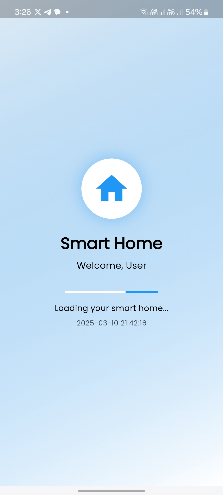
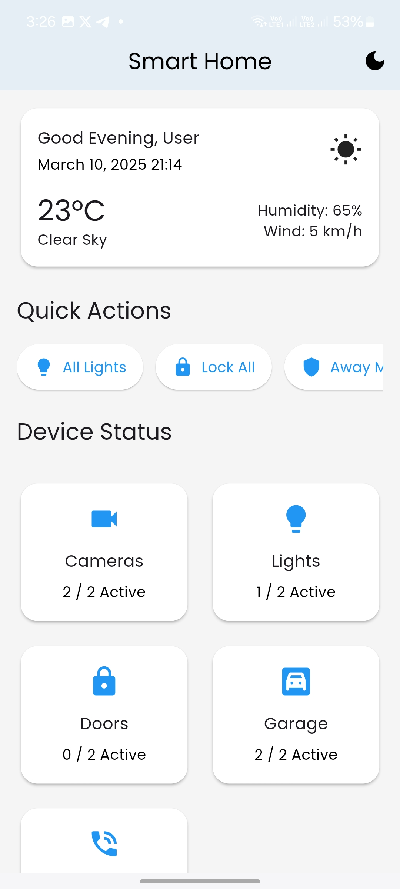
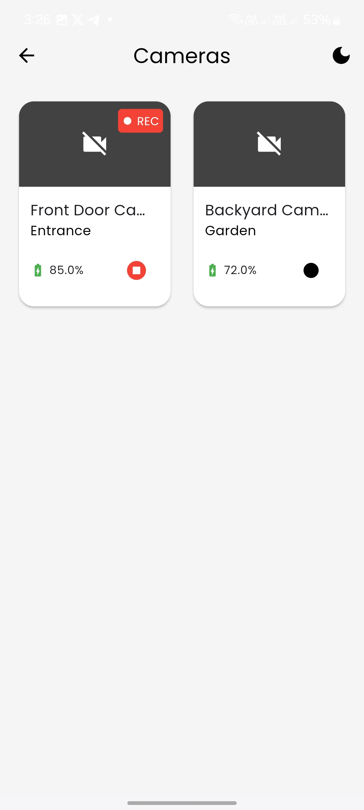
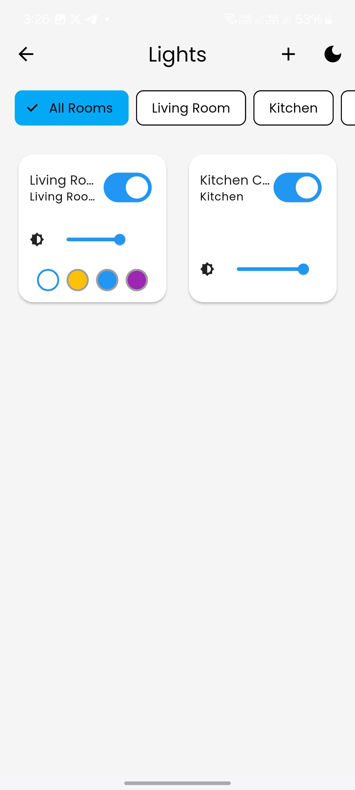
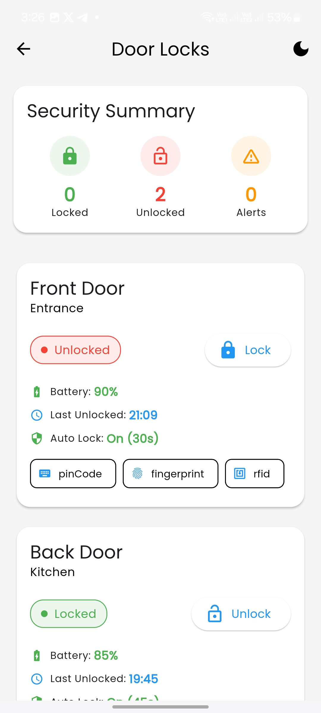
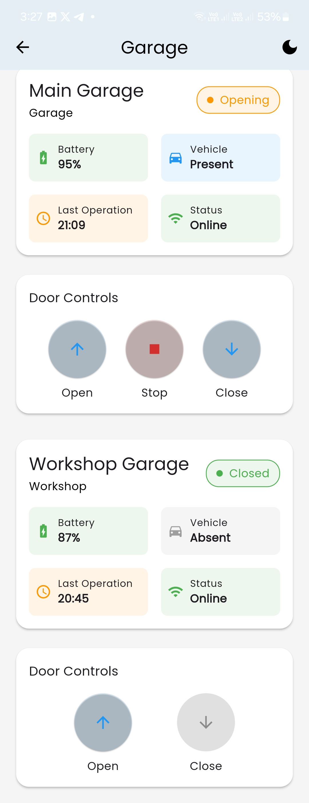
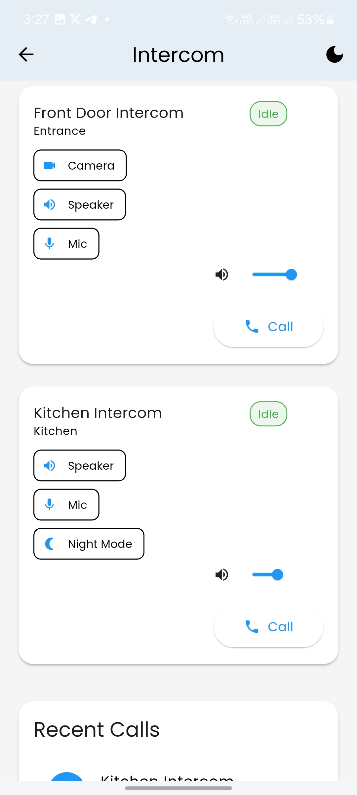

# Smart Home Control App

<p align="center">
  
</p>

A modern Flutter application for controlling and monitoring smart home devices. Built with Material Design 3 and featuring a clean, intuitive interface for managing various home automation systems.

<p align="center">
  
</p>

## Features

### 🎥 Camera Monitoring
- Real-time camera feeds
- Motion detection alerts
- Recording management
- Night vision support

<p align="center">
  
</p>

### 💡 Light Control
- Individual and group control
- Brightness adjustment
- Color temperature management
- Scheduling capabilities

<p align="center">
  
</p>

### 🚪 Door Management
- Smart lock control
- Access history
- Battery monitoring
- Tamper alerts

<p align="center">
  
</p>

### 🚘 Garage Control
- Door status monitoring
- Remote operation
- Vehicle presence detection
- Operation history

<p align="center">
  
</p>

### 🔊 Intercom System
- Video calling
- Audio communication
- Visitor management
- Night mode support

<p align="center">
  
</p>

## Getting Started

### Prerequisites
- Flutter 3.0 or higher
- Dart 3.0 or higher
- Android Studio / VS Code
- iOS 12+ / Android 6.0+

### Installation

1. Clone the repository:
```bash
git clone https://github.com/Ramy888/smart-home.git
```

2. Navigate to the project directory:
```bash
cd smart-home
```

3. Install dependencies:
```bash
flutter pub get
```

4. Run the app:
```bash
flutter run
```

## Architecture

The app follows a clean architecture pattern with:
- Provider for state management
- Repository pattern for data handling
- Service-based architecture for device communication
- Material Design 3 for UI components

### Project Structure
```
lib/
├── models/        # Data models
├── providers/     # State management
├── screens/       # UI screens
│   ├── cameras/
│   ├── lights/
│   ├── doors/
│   ├── garage/
│   └── intercom/
├── services/      # Business logic
├── utils/         # Helper functions
└── widgets/       # Reusable components
```

## Key Features

- **Responsive Design**: Adapts to different screen sizes
- **Dark Mode**: Full support for light and dark themes
- **Offline Support**: Basic functionality without internet
- **Real-time Updates**: Instant device status changes
- **Security**: End-to-end encryption for device communication
- **Custom Animations**: Smooth transitions and feedback

## Contributing

1. Fork the repository
2. Create your feature branch (`git checkout -b feature/AmazingFeature`)
3. Commit your changes (`git commit -m 'Add some AmazingFeature'`)
4. Push to the branch (`git push origin feature/AmazingFeature`)
5. Open a Pull Request

## License

This project is licensed under the MIT License - see the [LICENSE](LICENSE) file for details.

## Acknowledgments

- Flutter Team for the amazing framework
- Material Design team for the design system
- All contributors who helped shape this project

## Contact

Ramy888 - [@Ramy888](https://github.com/Ramy888)

Project Link: [https://github.com/Ramy888/smart-home](https://github.com/Ramy888/smart-home)

## Version History

- v1.0.0 (2025-03-11)
    - Initial release
    - Basic device control
    - Real-time monitoring

Last Updated: 2025-03-11 13:16:46